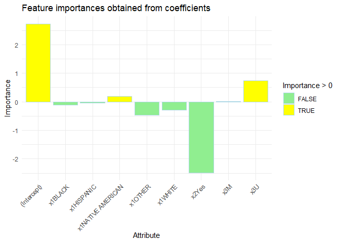

# Blog post 6
Team 9
2023-12-04

``` r
load("C:/Users/pfwan/OneDrive/Desktop/MA 615/ma-4615-fa23-final-project-burg-team-9/dataset/traffic_violations.RData")

mydata <- traffic_data_clean

#choose Arrest types as our binomial dependent variables, which 'marked' arrest type as 1 and 'Unmarked' arrest type as 0#
mydata$Arrest_Type <- ifelse(grepl("Marked", traffic_data_clean$`Arrest Type`), 1, 0)

x1 <- mydata$Race
x2 <- mydata$Alcohol
x3 <- mydata$Gender

X <- data.frame(x1,x2,x3)
Y <-mydata$Arrest_Type

#Build Train and Test datasets#


split_index <- sample(1:length(x1), size = floor(0.8 * length(x1)))


x_train <- X[split_index, ]
x_test <- X[-split_index, ]
y_train <- Y[split_index]
y_test <- Y[-split_index]


#initialize the original binomial linear regression, choose Race, Alcohol and Gender as independent variables with x_train datasets#

model <- glm(y_train ~ ., data = cbind(y_train, x_train), family = "binomial")
 
summary(model)
```


    Call:
    glm(formula = y_train ~ ., family = "binomial", data = cbind(y_train, 
        x_train))

    Deviance Residuals: 
        Min       1Q   Median       3Q      Max  
    -2.6422   0.3625   0.3744   0.4098   1.2795  

    Coefficients:
                       Estimate Std. Error z value Pr(>|z|)    
    (Intercept)        2.724836   0.014835 183.672  < 2e-16 ***
    x1BLACK           -0.108080   0.015369  -7.032 2.03e-12 ***
    x1HISPANIC        -0.040798   0.015951  -2.558   0.0105 *  
    x1NATIVE AMERICAN  0.189597   0.088546   2.141   0.0323 *  
    x1OTHER           -0.470701   0.018194 -25.871  < 2e-16 ***
    x1WHITE           -0.295801   0.015148 -19.528  < 2e-16 ***
    x2Yes             -2.490942   0.044698 -55.728  < 2e-16 ***
    x3M                0.005761   0.006716   0.858   0.3910    
    x3U                0.734905   0.098778   7.440 1.01e-13 ***
    ---
    Signif. codes:  0 '***' 0.001 '**' 0.01 '*' 0.05 '.' 0.1 ' ' 1

    (Dispersion parameter for binomial family taken to be 1)

        Null deviance: 788609  on 1508357  degrees of freedom
    Residual deviance: 784194  on 1508349  degrees of freedom
    AIC: 784212

    Number of Fisher Scoring iterations: 5

In the original model we generated, we have observed that except the
variable “male Gender”, every other categorical variables has
significant effect in the prediction of probability of our dependent
model, which points out that there is relation between the categorical
variables we choose and their arrest type probability.

What’s more, based on the coefficient value, we can summarize that the
variables “Black”,“Hispanic”,“Other” and “white” in Categorical “Race”,
the variable “Alcohol” has negative log-odds, which means that will
lower the probability they got arrest type as “marked”. While the
variables “Male” “U” in Categorical variable”Gender”, the Race “Native
American” has positive log-odds, which will increase their probabiliry
they got the arrest type as “Marked”.

``` r
#Build Feature Importance#

coefficients <- coef(model)
variable_names <- names(coefficients)

importances <- data.frame(
  'Attribute' = variable_names,
  'Importance' = coefficients
)

library(ggplot2)
```

    Warning: package 'ggplot2' was built under R version 4.3.1

``` r
ggplot(importances, aes(x = Attribute, y = Importance, fill = Importance > 0)) +
  geom_bar(stat = "identity", color = "lightblue") +
  scale_fill_manual(values = c("lightgreen", "yellow")) + 
  labs(title = "Feature importances obtained from coefficients") +
  theme_minimal() +
  theme(axis.text.x = element_text(angle = 45, hjust = 1)) +
  xlab("Attribute") +
  ylab("Importance")
```



``` r
#Build Confusion matrix, find accuracy#

Y_pred <- predict(model, newdata = cbind(y_test, x_test), type = "response")
#we choose the 0.92 as the diff of our predict outcome#
Y_pred_binary <- ifelse(Y_pred > 0.5, 1, 0)

accuracy <- mean(Y_pred_binary == y_test)

print(accuracy)
```

    [1] 0.9274868

``` r
table(Y_pred_binary)
```

    Y_pred_binary
         0      1 
       262 376828 

``` r
print(sum(Y_pred_binary == 0)/sum(Y_pred_binary==1))
```

    [1] 0.0006952774

``` r
print(sum(Y == 0)/sum(Y==1))
```

    [1] 0.07869144

Our model accuracy is 0.9277944, which roughly is %92.78, when we pick
the predict probability larger than 0.5 as 1 and less than 0.5 as 0.
Compare with the marked and unmarked arrest type proportion, we may
cautiously evaluate this model’s accuracy because we have to think about
the probability of overfitting in our mode and the imbalance in our
model.

``` r
#Confusion Matrix#
library(caret)
```

    Warning: package 'caret' was built under R version 4.2.3

    Loading required package: lattice

``` r
conf_matrix <- confusionMatrix(factor(Y_pred_binary), factor(y_test))
print(conf_matrix)
```

    Confusion Matrix and Statistics

              Reference
    Prediction      0      1
             0    152    110
             1  27234 349594
                                              
                   Accuracy : 0.9275          
                     95% CI : (0.9267, 0.9283)
        No Information Rate : 0.9274          
        P-Value [Acc > NIR] : 0.3976          
                                              
                      Kappa : 0.0096          
                                              
     Mcnemar's Test P-Value : <2e-16          
                                              
                Sensitivity : 0.0055503       
                Specificity : 0.9996854       
             Pos Pred Value : 0.5801527       
             Neg Pred Value : 0.9277283       
                 Prevalence : 0.0726246       
             Detection Rate : 0.0004031       
       Detection Prevalence : 0.0006948       
          Balanced Accuracy : 0.5026179       
                                              
           'Positive' Class : 0               
                                              

In the above summary, we have notices that the null deviance is 984980
and residual deviance is 979510, and the deviance range is
(-2.6691,1.2755), and our model may contains over fitting because of the
imbalance outcome proportion in our dependent variable.

Based on the current outcome of our origional model, to enhance the
performance of our original model, we are exploring several avenues for
improvement. First and foremost, our current dataset comprises solely
categorical variables. Introducing relevant numerical variables could
significantly augment our model’s predictive capabilities, particularly
when utilizing logistic regression as our analytical framework. To
achieve this, we are considering merging our existing dataset with other
correlated datasets, a step we believe is crucial in uncovering
additional potential relationships between the dependent and independent
variables.

Additionally, we recognize the imbalance in our current dependent
variable. To address this, we are contemplating the exploration of
alternative dependent variables. Building multiple analysis models with
varied dependent variables can provide a broader perspective,
potentially revealing different relationships and leading to more robust
conclusions. This approach not only enhances the stability of our
findings but also enriches our exploratory data analysis (EDA) by
fostering new insights.

By diversifying our dataset and exploring alternative dependent
variables, we aim to refine our understanding of the underlying
relationships, ultimately improving the overall performance and
reliability of our analytical models.

We plan to polish our visualizations and tables after finalizing our
model to best show the data in terms of our method of statistical
modeling. This will include highlighting information that informed the
variables we made the decision to include. For example, in our
scatterplot from our exploratory data analysis we will highlight the
variables race, alcohol, and gender which seemed to have a potential
relationship with arrest_type_numeric to show that this contributed to
these variables being chosen for our statistical model. We also plan to
add titles to our visualizations and tables to more clearly show what is
being modeled in that particular plot.

Additionally, we will polish up our data visualizations by adding
captions and annotations to write a short summary of what our takeaways
from that visualization were. For example, in the scatterplot mentioned
before we will add a caption or annotation saying that only race,
alcohol, and gender appear to potentially have a relationship with
arrest_type_numeric. We also plan to improve our figures using the
options for displaying tables from https://gallery.htmlwidgets.org/,
particularly the scatterD3 option to include both colors and comments
more clearly for specific points in our plots. We are also planning to
use pairsD3 to be able to show various relationships between variables
that we explored to choose our model.

We are still trying out different EDA, with GLM being the priority. We
are still unsatisfied with produced results, but we believe we could
reach a conclusion that everyone can agree.
